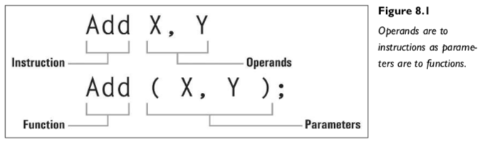
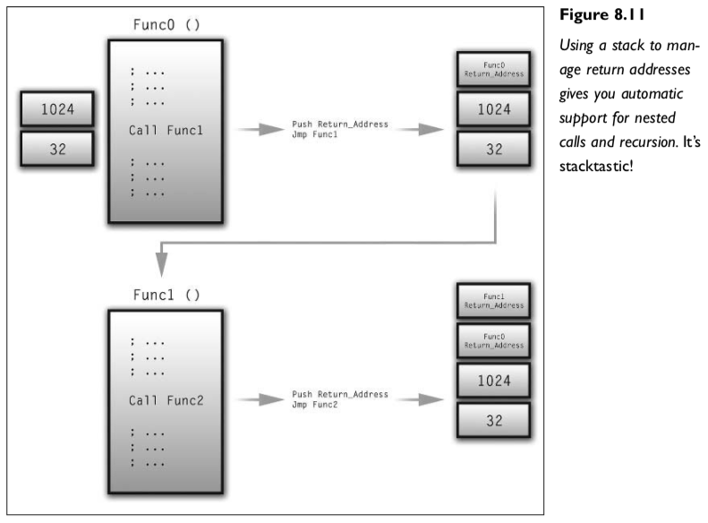

第八章 汇编语言

## 汇编语言的工作原理

对于新手来说，汇编语言通常被视为使用起来不太方便、玄妙难懂且普遍困难。当然，大多数人对于计算机编程亦会同样感受，所以不必听信那些说汇编难用的人。毫无疑问，与高级编程语言相比，汇编语言相对更难；但只要采用正确的方式，它就能和其他东西一样容易学习。

### 指令

汇编语言是汇编指令的集合。指令通常是一个简短的单词或缩写，对应着CPU（或虚拟机）能够执行的一个原子操作。例如，任何CPU都有大量的内存移动操作；从内存的一个区域取值，将其放到另一个区域。在Intel 80X86汇编语言中，指令Mov（Move的缩写）用来实现这个操作。可以将Mov视为C语言的赋值运算符“=”的低级版本；它会将源存储单元中的内容传输到目的存储单元。例如，在C语言中，以下行：

    MyVar0 = MyVar1;

可能会被编译成以下行：

    Mov MyVar0, MyVar1

本质上，这行代码将 MyVar1 的值移动到 MyVar0。一种汇编语言所提供的指令集合被称为其指令集，用户可利用这些低级指令实现任何高级编码结构的同等效果，包括if块，函数，while循环等等。基于此，汇编指令涵盖从移动内存，像你刚刚看到的Mov指令，到执行简单的算术运算和位运算，对值进行比较，或者基于一些条件逻辑将执行流程转移到另一个指令。

### 操作数

指令的力量来自于它的操作数，操作数被传递给指令，由指令执行具体的操作。在Mov的例子中我们看到了操作数。Mov是一个通用指令，用于将内存从一个区域移动到另一个区域。没有操作数，你就无法告诉Mov要移动什么，或者要将它移动到哪里。

操作数的概念如图8.1所示。



图8.1 操作数和指令的关系与参数和函数的关系相当

### 表达式

实际上，在汇编语言中无法使用下面这样的表达式：

```asm
Mov X, ( Y + Z ) * 2 / W
```
那么如果需要表示这样的表达式怎么办呢？答案是需要将其分解成原子操作，使用多个汇编指令达成目标。比如说现在我们分解表达式( Y + Z ) * 2 / W：

- 因为括号优先，先执行 Y + Z。
- 将 Y 和 Z 的和乘以 2。
- 然后将乘积除以 W。

也就是说，在使用汇编语言表示表达式时，需要先将其拆分为足够小的操作，再使用相应的指令来执行这些操作。刚才的例子，我们将表达式 `(Y + Z) * 2 / W` 拆分为三个算术运算：加法、乘法和除法， 并使用临时变量存储表达式中的中间结果，最终将结果存储在目标变量中。

好嘞，那么这里有个问题：第二步要求你把Y和Z的和乘以2，那怎么做呢？因为汇编语言不支持任何形式的表达式，所以你肯定不能这样做： `Mul Y + Z, 2`

因为`Y + Z` 是一个表达式，并没有一块内存地址指向这个表达式。虽然 `Y + Z` 的和并不是整个表达式的最终结果，我们仍然需要将其暂时保存在某个变量中。见下面的代码：

```asm
Mov    Temp, Y ; 将 Y 移到临时变量 Temp 存放
Add    Temp, Z ; 将 Z + Temp 存放在 Temp 中
Mul    Temp, 2 ; 将 2 剩以 Temp 即( Y + Z )
Div    Temp, W ; 将 W 被 Temp 除，得到最终结果，存放在 Temp 当中
Mov 	 X, Temp ; 将 Temp 移到变量 X
```
我们使用Temp变量存储 Y 和 Z 的和，然后乘以2。这里我们引入了Add指令，它将第二个操作数加上第一个操作数，然后保存到第一个操作数对应的内存单元。然后调用 Mul指令乘以2，最后调用Div指令，除以 W。

在整个过程中，Temp这个中间变量，保存了表达式每一小步的中间值，直至产生最终结果。在汇编语言编程过程中，使用中间变量乃是居家常备不得不备的技术。

此外，从这一代码清单我们可以合理推断，这种汇编语言使用分号表示单行注释。第二，Div指令是将第一个操作数除以第二个操作数。


图8.2 将 C 表达式分解为汇编指令。

**注意**

虽然纯汇编语言不支持表达式，但现代汇编器，即宏汇编程序，能够解释完整的表达式，并自动为它们生成正确的指令。虽然这有点模糊了编译器和汇编器的界限，但这一特性真的很方便。

使用Mov、Add、Mul和Div这些指令，我们成功地用汇编解析了 C 语言表达式。确实汇编语言编写起来不像高级语言一样直观，但只要你多做练习，渐渐得到经验，它会变得非常自然。

### 跳转指令

与C语言类似，汇编语言通常从第一条指令顺序执行到最后一条指令。不过，汇编语言的跳转指令，就像 C 语言的goto 关键字，可以改变汇编指令的执行流程。尽管计算机课上老师一般不赞成我们使用 goto 语句，然而在汇编语言编程实践之中，跳转指令却是核心指令。它们允许执行流程从一条指令“跳转”到另一条指令，中断了本来的顺序执行流程。

跳转是理解汇编语言中循环和迭代概念的关键。如果需要重复执行某段代码，可以使用跳转指令将执行流程移回需要循环的代码的起始位置，从而导致它再次执行。在 C 语言中，我们这样实现无限循环:

```C
while ( 1 ) {
     // ...
     // ...
     // ...
}
```

下面我们用汇编来编写同样效果的循环：

```ASM
LoopStart:
    ; ...
    ; ...
    ; ...
Jmp LoopStart
```
与 C 语言一样，汇编语言支持定义行标签。在最后一行中的 Jmp 指令（Jump的缩写）是无条件跳转，它总是将执行流转移到指定的行标签处。


图8-3 使用 Jmp 指令制造一个无限循环

最后，考虑将此代码用另一种形式的C重写，但它看起来更像汇编版本：

```C
LoopStart：
// ...
// ...
// ...
goto LoopStart;
```

如你所见，这段C代码与前面的汇编代码几乎完全相同。看，汇编并非与 C 格格不入。

### 条件逻辑
无条件跳转虽然有用，但过于死板，因此我们还需要更科学的方法来控制代码的执行流程。在 C 中我们可以使用 if 来进行流程控制，if 可以根据布尔表达式的结果跳转到程序的不同部分。

```C
if ( X > Y )
    // True case
else
    // False case
```


在汇编中也可以达成同样目标，一个小遗憾是汇编语言里没有布尔表达式。毕竟能解决总比无法解决好，次优解也是解。通过将比较指令和条件跳转指令相结合，我们可以模拟 C 语言中 if 语句的功能。

为了在汇编语言中模拟 C 语言中的 if 语句，我们需要使用 Cmp 指令（Compare的缩写）进行比较，并使用条件跳转指令根据比较结果跳转到相应的代码块。Cmp 指令比较两个值，并产生一个结果。而条件跳转指令只在特定情况下跳转。 你可能会问，比较结果存储在哪里？我们先放过这个问题，看下面的代码：

```asm
Cmp    X, Y
JG     LineLabel
```

指令 Cmp X, Y 比较两个值，而 JG 则是条件跳转：仅在上一次比较的结果为“大于”时才跳转到标签 LineLabel。JG 不关心 X 和 Y，只关心 Cmp 比较结果。看下面的代码：

```asm
    Cmp    X, Y
    JG     TrueCase
    ; Execute false case
    Jmp    SkipTrueCase
TrueCase:
    ; Execute true case
SkipTrueCase:
    ; The "if construct" is complete,
    ; so the program continues.
```


在这个例子中，首先比较 X 和 Y，接着执行“大于则跳转”（JG）指令。若比较结果是大于，跳到TrueCase继续执行；否则不跳，接着向下执行，直到遇到 `Jmp SkipTrueCase`指令后无条件跳到 SkipTrueCase，以跳过 TrueCase部分，避免执行那些语句。

这种方法很有效，不过有一个小问题；代码块的顺序不太理想：False 代码块位于 True 代码块的上方，这不是什么大问题，也不是不能解决。在汇编语言中，除了我们介绍过的 JMP和JG，还有许多其他的跳转指令，例如JE（相等则跳转）、JNE（不相等则跳转）和JGE（大于或等于则跳转）等。下面我们修改前面的代码示例，实现False块和True代码块互换位置：

```ASM
    Cmp    X, Y
    JLE    FalseCase
    ; Execute true case
    Jmp    SkipFalseCase
FalseCase:
    ; Execute false case
SkipFalseCase:
    ; The "if construct" is complete,
    ; so the program continues.
```

在汇编语言中，跳转指令是控制程序流程的关键，类似于C语言中的goto语句。使用比较指令和条件跳转指令可以模拟C语言中的if语句。比较指令会将两个值进行比较，并将结果存储在标志位中。条件跳转指令会检查标志位，并根据标志位的值来决定是否跳转到指定的代码块。通过使用跳转和比较指令，可以实现汇编语言中的循环和分支控制。

### 循环

在低级语言中，循环同样重要，而跳转指令是实现汇编语言程序（或脚本）中迭代的不可或缺的部分。除了条件逻辑，跳转指令还具有其他功能。回想一下无限循环的例子，它展示了跳转指令和代码块中的标签是如何构成循环的“顶部”和“底部”的。我们再看一遍这个例子：

```ASM
LoopStart:
    ; ...
    ; ...
    ; ...
Jmp LoopStart
```

循环是编程中非常常见的结构。在汇编语言中，我们使用标签和无条件跳转指令（Jmp）实现循环。但是，一个简单的无条件循环并没有太多用处。因此，我们需要使用条件跳转指令来控制循环的执行。在上一节中，我们已学习了如何使用条件跳转指令来控制程序流程。事实上，无论是 while 循环还是 for 循环，都可以用条件跳转来实现。循环通常包括一个布尔表达式和一个代码块。在每次迭代时，先对表达式进行求值。如果求值结果为 true，则执行代码块并重复此过程。当某些条件使得布尔表达式的值为 false 时，循环终止，程序恢复顺序执行。看看下面这个 while 循环：

```c
// Set X to 16
int X = 16;
// Loop as long as X is greater than zero
while ( X > 0 )
  // Decrement X by 2 at each iteration
	X -= 2;
```

以及它的汇编语言版本：

```ASM
; Set X to 16
Mov    X, 16
; Provide a label to jump back to
LoopStart:
	; Subtract 2 from X
	Sub X, 2
	; Compare X to zero
	Cmp X, 0
	; If it's greater, reiterate the loop
	JG LoopStart
  
```

这里我们学习到一个新指令 Sub，它将第二个操作数从第一个操作数中减去。接下来看代码，我们先将数字16赋值给寄存器X，这相当于C语言中的赋值语句。我们接着创建了标签LoopStart，代表循环块的顶部。接下来是循环体，与C语言一样，我们只需要将寄存器X减2。最后，我们实现了循环终止的逻辑：将寄存器X和数字0进行比较，仅在X大于0时才继续循环。下图展示了汇编语言循环的基本结构。


值得一提的是，例子里这个汇编版本的循环行为与C语言while循环版本的行为并不完全相同。C的while循环仅在表达式为真时循环；因此，若表达式在循环开始时即为false（无论什么原因），则循环体不会执行。而这个汇编语言版本的循环在循环体的末尾才去检查条件，因此循环体至少会执行一次。这确实是一个问题，但并非不可以解决。你可以改写这段代码，试着解决这个问题。

### 汇编语言（助记符）与机器码

我们都知道 CPU 不懂汇编语言，即便是像下面这样简单的汇编，CPU一样不懂：

```ASM
Mov     X, Y
Add     X, Z
Div     Z, 2
```

它只懂二进制机器码。

当我还是个孩子的时候，经常和朋友们一起进行各种刺激而危险的任务，比如骚扰邻居家的女孩。但这种活动是有风险的，需要使用安全的通讯方法，以确保命令能够安全地传达给领域代理而不被敌方拦截。因此，我们想出了一个绝对防护、完美加密的方案，即将字母转化为数字。具体来说，我们给字母表中的每个字母都分配了一个数字，A 变成了 0，B 变成了 1，C 变成了 2，以此类推。当然这个例子并不是那么恰当，毕竟我们只有10个数字，但我们有26个字母。这只是个故事，我们就假定有一个世界里有26个数字刚好能和英文字母对应就好了。

这样消息 "Lisa is sitting on her steps with a book. This is clearly a vile attempt to thwart our glorious mission. Mobilize all forces immediately. Use of deadly force (E.G., water balloons) is authorized. Godspeed."，就能被顺利地转换成一串数字。

这种加密方式虽然简单，但却非常有效，不懂我们规则的人无从破解我们的信息。类似地，汇编语言和机器码之间的区别也只是表现形式上的差异，数据本身是一样的，只是表达方式不同。下面我们试着把上面的汇编代码片段转换成等价的机器码，用数字的形式表达。

我们首先需要为每个指令分配一个独特的整数代码。例如，我们可以规定Mov是0，Add是1，Div是4（假设Sub和Mul占用了2和3）。那我们将上面的汇编代码转换成机器码的第一步，会得到下面的结果：

```ASM
0 	X, Y
1 	X, Z
4 	Z, 2
```

几乎任何语言，无论是汇编语言、C语言还是XtremeScript，在编译那一刻代码中所包含的变量数量是已知的，因此我们可以利用这个事实来消除变量名，用数字来代替它们。我们这个例子中有三个变量：X、Y和Z。我们不妨把X变成0，Y变成1，Z变成2：

```ASM
0 	0, 1
1 	0, 2 
4 	2, 2
```

现在我们有了一个原始代码的新版本，它保留了所有的信息，而且除了空白和逗号全部都是数字代码。空白，逗号上换行只是为了提高代码的可读性，所以它们可以统统被拿掉，于是我们得到了

```ASM
001102422
```

这样一串数字，其中001代表第一条指令（Mov X, Y），102代表第二条指令（Add X, Z），而422代表最后一条指令（Div Z, 2）。这个最终的数字串就是机器码，或者在虚拟机的上下文中称为字节码。这不是一个汇编器的完美例子，但它已经足够接近，至少概念是清晰的。我们将在下一章中运用这些技术，创建一个真正的汇编器，设计一种汇编语言。

### 正交的指令集

我们应该将指令集设计成正交的指令集。这意味着，有加法指令就有相应的减法指令。尽管技术上减法就是对负数的加法。减法指令并非不可或缺，但是有了它，事情就变得更容易，因为这样我们不必为了使用加法指令模拟减法而不断地对所有要减去的数进行取反。

另外，指令的正交性不仅意味着逻辑上的正交，也可以扩展到某些指令的功能。举例来说，Intel 80X86汇编在基本算术指令的实现并不完全正交，因为Add和Sub指令与Mul和Div指令在工作方式上不同。Add和Sub接受两个操作数，并从其中一个中加上或减去另一个。然而，Mul和Div只接受一个操作数，将将其值乘以或除以已经存储在先前指定位置的另一个值（即AX寄存器，但我尚未讲到寄存器，如果现在不理解也不要紧）。这样的不规则设计往往会使程序员感到不适，在我们设计自己的汇编语言时，到底应该在多大程度上实现正交，值得认真思考权衡。

### 寄存器

在继续之前，我想讲一下寄存器。那些有一定汇编语言经验的人，可能想知道脚本系统的虚拟机是否有与实际 CPU 寄存器集类似的模拟。在回答这个问题之前，让我简单地解释一下什么是寄存器，以便让不太了解的人跟上进度。

简单地说，寄存器是直接位于 CPU 上的非常快速、非常紧凑的存储位置。与必须通过数据总线到达处理器的存储器不同，寄存器可以立即使用并有着显著的速度优势。汇编语言程序员和编译器都非常重视寄存器；由于它们的速度和数量有限，它们是一种罕见而珍贵的资源。

不用深入讨论，你也能够理解寄存器的使用有多么重要。但是，对 XtremeScript 虚拟机来说，寄存器基本上是没有用处的。记住，我们的整个虚拟机将存在于同一个内存地址空间中；它的任何部分都不比其他任何部分更快或更高效。因此，XVM 中的内存模型将是一种简单的基于堆栈的方案，包括一些额外的随机访问功能。在XtremeScript虚拟机中，定义“寄存器”组不会带来任何实际优势。

**注意**

寄存器速度快，使用简单。不仅如此，寄存器之所以被广泛使用，是因为它们提供了一种从汇编语言程序的任何地方以相同的方式访问数据的方式，不受范围或功能嵌套的影响。哦，简直就是超级快的全局变量！使用寄存器能够将简单数据从一个代码块快捷的传递到另一个代码块，而使用传统的内存访问方式，则可能会出现困难。

### 栈

目前为止，至少在概念上你已学会使用汇编语言做很多事情。你知道如何用低级语言实现高级语言的常见结构，例如表达式、分支和循环。不过，我还没有提到函数。大多数运行时环境，无论是虚拟的还是物理的机器，都提供了某种形式的运行时栈（也简称为栈）。由于栈具有自我扩展和收缩的固有能力，以及数据严格地按照预定顺序压入和弹出，因此它是管理频繁变化数据的理想数据结构。 在一个典型的高级语言程序的运行过程中，它不断地进行函数调用。一个函数往往会调用其他函数，甚至有可能自己调用自己（递归）。总之，函数及其调用在嵌套变得越来越深的过程中“堆积”起来，直到最终被解开。这正是栈的工作原理。

为了更好地理解这一点，首先要思考函数是如何调用的。如果你将编译后的脚本视为一组简单的指令数组，每个指令都有一个唯一且顺序的索引，那么给定指令或指令块的实际位置可以表示为这些索引之一。因此，为了调用一个函数，你需要知道该函数在数组中第一个指令的索引，也称为函数的入口点。然后，你需要跳转到这个指令，函数就开始执行了。这听起来像是一个典型的跳转指令，对吧？

到目前为止，一切顺利。从这里开始，运行时环境将像处理其他任何代码一样开始执行函数的代码。但等等，运行时环境如何知道函数何时结束呢？此外，即使它确实知道函数在哪里结束，它又如何知道如何返回到调用它的指令？毕竟，函数必须将执行流程返回给它们的调用者。你不能仅仅使用跳转指令来返回到调用你的指令的索引，因为你不知道那个索引在哪里。此外，函数可以从代码中的任何位置调用，这意味着你不能在代码中硬编码跳回到特定指令。请参见图 8.9。


现在我们来解决这个问题。函数运行结束，该如何返回呢？我们其实应该在跳转到函数之前事先规划好，这样就会容易许多。为了让函数知道应该回到什么位置，就如同函数入口对应指令的索引一样，它需要知道返回位置对应指令的索引。因此，在进行调用之前，我们需要将返回地址压入栈中。这样，函数只需要在返回前从栈中弹出顶部的值即可确定返回的位置。简单吧！

大多数 CPU 用于访问堆栈的指令被称为 Push 和 Pop。Push 接受一个值并将其压入栈。Pop 接受一个内存引用，将堆栈顶部的值弹出并存入其中。堆栈是全局结构，这意味着在程序的任何部分都能访问到。我们不但能在调用函数之前（函数外）将函数的返回地址压入堆栈，与能从函数内访问它。图8.10显示了汇编中的一般堆栈使用。


函数并不需要结束标记，在函数的末尾，我们调用另一个跳转指令来结束它——跳到返回地址。通常有两个专门的指令服务这个任务：Call 和 Ret。

Call指令和Jmp指令很像，因为它也改变执行流程跳转到另一个指令。但是，除无条件中转到另一个指令之外，Call指令会将当前指令的索引 **+1** 之后压入堆栈。之所以将自己的地址 **+1** 是确保函数能返回到Call指令的下一条指令，而不是返回它自己的地址，否则会造成无限循环。Ret指令也执行无条件跳转，但它会主动弹出堆栈顶部的值并将其视为返回地址。Call和Ret是高级跳转指令，强强联手，轻松实现了函数的调用和返回。

栈是存储函数返回地址的理想数据结构，它支持动态地增加和减少元素，并保持元素的顺序。栈的性质决定了函数调用天生具备嵌套和递归的能力。从一个函数中调用其他函数，栈会不断增长，直到最后一个被调用的函数返回。随着函数返回地址的依次弹出，栈会不断缩小。因为函数是按顺序调用的，而这种顺序被栈固有地保留着，所以函数们总能按照进栈相反的顺序出栈，不用担心返回地址出错。图8.11说明了这个概念。



**注意**
这里有一个陷阱。由于Ret指令总是假定堆栈顶部保存着函数的返回地址，因此若返回之前在函数内有意或者无意的改变了堆栈的数据，程序就一定会执行异常。有两种方法可以避免这一点——要么函数内就根本不碰堆栈，要么就要确保在Ret执行之前弹出它压入栈的所有值，以确保函数开始时的栈顶，到函数结束前仍然是那个栈顶。

### 栈帧/激活记录 

到目前为止，一切都很顺利，我们已经学会了如何使用堆栈来进行基本的函数调用。然而绝大多数函数都有至少一个参数。参数当然会使事情变得复杂一点，但幸运的是，这仍然是一个相对简单的过程。 把参数传递给一个函数，本质上是一种发送信息的方法。我们目前实现的函数能够通过栈将返回地址传递给被调用的函数，同理，我们也可以用栈来传递参数——将参数们和返回地址一起压入堆栈。

当一个函数被调用时，先把它的参数们按约定顺序压入栈中，顺序可以是从左到右，也可以是从右到左，只要压入和读取的方式保持一致即可。参数进栈之后，紧接着函数返回地址进栈。然后函数自其入口开始执行，在函数执行时会读取传递给它的参数，因此函数需要读取栈，但不是以弹出的方式。函数其实可以随机访问它的任何一个参数，有点儿像使用数组的索引访问一个数组。函数的每个形参都对应着堆栈的一个偏移量。假设我们有这样一个函数原型：

```ASM
Func MyFunc ( X, Y, Z );
```

它有三个参数，假设这些参数及函数的返回地址按照下面的顺序进栈：

```
Parameter X
Parameter Y
Parameter Z
Return Address
```

那么，从栈顶向下看，函数的返回地址会在最上面（栈顶），然后是参数Z，再是参数Y，最后是参数X：

```
Return Address
Parameter Z
Parameter Y
Parameter X
```

换句话说，栈顶是函数的返回地址，栈顶 **-1** 的位置是参数Z，栈顶 **-2** 的位置是参数Y，栈顶 **-3** 的位置是参数X。务必记住，由于堆栈的工作方式，最先推送参数离栈顶最远。如果你希望函数读取参数的顺序与形参的顺序一致，就需要以相反的顺序（从右到左）把它们压入栈。如果你不在乎，也可以像本例一样，从左到右入栈，只是在读取这些参数的时候，栈顶 **-1** 的位置是参数Z，栈顶 **-2** 的位置是参数Y，栈顶 **-3** 的位置是参数X。

**注意** 

我建议将函数参数按照从右到左的顺序推进栈。这样一来，虽然参数进栈的顺序不够自然，但函数在读取这些参数时，却得以用与形参一致的顺序读取。

函数返回时，需要弹出之前推入的函数参数。但是，为了避免每次函数调用之后都要紧跟着写一串 Pop 指令，我们可以给 Ret 指令提供一个整数，表示自动弹出多少个栈元素。以我们刚才的函数为例，只要在函数末尾使用：

```ASM
Ret 3 ; 自动清除三个参数
```

就不需要手工写Pop指令弹出那些参数了。

参数的问题解决了，那么返回值呢？既然参数可以通过堆栈传递，返回值是否也可以？很遗憾，按照目前的堆栈布局设计，答案是不能。若采纳这个方案，我们将不得不在函数返回前把返回值压入堆栈，这破坏了栈顶是函数返回地址的约定。

既然不能使用栈，那该怎么办呢？毕竟我们的虚拟机除了栈之外，没有任何其他全局存储单元，我们还能有什么选择？为了解决这个问题，让我们看看80X86汇编语言的处理方式。

与我们的虚拟机不同，80X86有许多通用寄存器。这些寄存器提供了一些存储位置，可以从汇编程序的任何位置访问。因此，要向函数的调用方返回一个值，只需将该值放入约定的寄存器即可，这样调用方在函数返回后就可以从中读取到返回值。在Intel平台上，惯例是使用累加器AX（或32位平台上的EAX）寄存器来完成这个任务。因此，只需要一条简单的Mov指令，将AX填充为函数的返回值。然后，调用方读取AX的值，事就这么成了。

我们的问题是，前面已经说过，我们这个虚拟机不会实现寄存器。这话不完全对，妥协一下，我们不会实现所有的通用寄存器，但会实现一个专门用来传输返回值的寄存器。

现在我们已经了解了函数调用的实现方式：我们设计了一个结构来保存返回地址、传递的参数，这个结构称为堆栈帧或者激活记录。本质上，它是一个为维护函数的信息而设计的结构。图8.12阐释了堆栈帧的概念。


### 局部变量和作用域

现在我们了解了如何通过栈调用函数并传递参数，以及如何使用特定寄存器返回值。那么问题来了，函数如何处理局部变量？

假设我们有一个递归函数，它会不断地调用自己，很快我们就会发现同一时间会有多个该函数的实例存在；假设该函数累计调用了自己六次（嵌套自己六层），那么在栈上就有六个堆栈帧。虽然函数本身的代码只有一份，但每次函数调用的参数并不相同，因此操作的数据（即它定义的局部变量的值）每次调用也不相同。这就要求我们必须对函数的堆栈帧做大幅扩展。

函数调用时，参数和返回地址已经保存在栈中，现在我们需要为局部变量腾出空间。因为栈可以智能地管理函数调用次序，因此把局部变量也存储在栈中是合理的。因此，堆栈帧实质上是为函数保存内部数据的位置。事实上，由于大多数程序代码都在函数中运行，这意味着我们几乎所有的脚本数据都存储在那里。我们可以把全局变量和函数外的代码保存在栈底，这样，我们在访问参数和局部变量时，使用相对于栈顶的负索引，如-1、-2、-3等，而在访问全局变量时，因为是相对于栈底访问的，我们使用索引如0、1、2等等。


我们不难看出， 堆栈在运行时环境中有多么重要。对于不支持动态分配数据的编程语言来说，存储整个脚本变量和数组所需的全部就是一个运行时栈， 以及一个用于获取函数返回值的寄存器。堆栈还负责管理及跟踪函数的调用顺序，并为表达式解析期间的中间值提供一个存储位置。这意味着除了少数例外情况外，“变量”的本质，不过是将一些变量名附加到相对于当前堆栈帧的偏移量上。

在很多方面，运行时堆栈是整个过程的核心。

### 介绍XVM汇编语言 

现在你已经对汇编语言有了相当的了解，是时候开始设计XtremeScript系统的运行时环境了。接下来我们将开始设计XVM汇编语言，这是为我们的XtremeScript虚拟机专门设计的汇编语言。

脚本在经过XtremeScript编译器编译之后，会被转换为XVM汇编语言。接下来的几章里，我们将一步步实现一个真正的脚本语言。不需要很久，它就能达到可实际使用的程度。

因此，这个XVM Assembly应该设计成对人类程序员尽量友好。这样在脚本语言的早期阶段，我们能够编写纯汇编脚本来来测试这个系统。毕竟这个阶段，我们的脚本语言还太不成熟。当然，这个语言的设计也应该对编译器友好，因此我们需要足够的指令来支持将一种类似C语言的高级语言编译为XVM汇编语言。

### 语言设计

首先，XtremeScript是无类型的，直接支持整数、浮点数和字符串。它也支持布尔类型，但我们在系统内部会把true和false视为整数值1和0。我们当然可以让底层的汇编语言支持强类型，但那样会带来不必要的性能损失。当我们可以用C来完成大部分工作时，没有必要在内存中手动管理不同数据类型的二进制表示。因此，我们把这种汇编语言也设计为无类型。这意味着我们可以汇编代码中直接引用整数、浮点数和字符串，而不必担心它们是如何实现的。我们会把这些工作留给运行时环境来处理，那一部分将是纯C，因此是非常快速的。

像下面这样的汇编代码在XVM汇编极其常见，不过我打包票，在真正的CPU上你肯定找不到这样的代码！

```ASM
Mov    MyInt, 16384
Mov    MyFloat, 123.456
Mov    MyString, "The terrible secret of space!"
```

XtremeScript支持数组。简单起见，XtremeScript支持数组索引，但不支持动态数组（可动态改变长度的数组）。

```ASM
Mov X, MyArray[Y]
```

关于数据的最后一个实际问题，是各种指令应如何解释不同的数据类型。例如，除法指令Div用于除以数字值，那么如果你尝试将64除以一个字符串会发生什么呢？在这种情况下，你有三个基本选择： 

- 停止脚本并生成运行时错误。 
- 智能地将数据类型进行转换。例如，将字符串值“128”除以一个数字时，会将该字符串临时转换为整数值128。
- 静默地将任何错误的数据类型变为空。换句话说，当需要字符串时传递一个数字，将会将该数字临时转换为空字符串。同样，当需要数字时传递一个字符串，将会将该字符串临时替换为整数值零。 

这更多是虚拟机设计阶段的问题，但它仍然会对你设计的语言本身产生一定的影响。现在，我们先不做最后的决定，不过我们肯定会在第二种或第三种处理方式中选其一。在程序员传递了不正确的数据类型作为操作数时，与其强制停止程序，不如允许这种情况并选择一种优雅的处理方法。

### XVM 指令集

接下来是指令集的详细介绍。值得注意的是，就像我们在 XtremeScript 中大量借鉴 C语言语法，XVM 汇编语言也很大程度上基于 Intel 的 80X86 语法，在一些必要的地方我也做了创新，以使各种指令更加直观方便。

#### 内存指令

```ASM
Mov Destination, Source
```

第一个指令是Mov。它的名称有点误导性。该指令实际上并不“移动”任何东西，源操作数在执行指令后仍在原地，并未被销毁。一个更合理的名字应该是Copy，因为该指令导致源操作数有了一个新副本。Mov将是我们使用最频繁的指令，不管用何种汇编语言编程，结果差不多都这样。

至于对于Source和Destination可以使用什么类型的操作数，Source可以是任何东西——整数、浮点数或字符串字面值，或者一个内存引用（即指针--变量或者数组索引）。Destination必须是某种类型的内存引用，因为将值“赋给”字面量是非法的。换句话说，Destination实际上遵循C语言中左值原则。

#### 算术指令

```ASM
Add           Destination, Source
Sub           Destination, Source
Mul           Destination, Source
Div           Destination, Source
Mod           Destination, Source
Exp           Destination, Power
Neg           Destination
Inc           Destination
Dec           Destination
```

接下来是算术指令族。这些指令（除了Neg）遵循与Mov相同的操作数规则。换句话说，Source可以是任何类型的值，而Destination必须是某种形式的内存引用。这些指令都支持整数和浮点数据。 有三个新成员，它们是Mod，Exp和Neg。Mod计算两个数的模，即Destination / Source的余数，并将计算结果放在Destination中。Exp计算Destination的Power次方。最后，Neg接受一个参数Destination，它是一个内存引用，将值就地取反。

不难看出，这一族指令属于CISC指令集。你可能注意到，这里提供的指令比实际CPU的算术指令集还多，这样做有一个巨大的好处：虚拟机可以直接执行XtremeScript支持的所有算术运算。想象一下，如果我们没有提供Exp指令，却在XtremeScript中保留了^（乘方）操作符。当编译代码为汇编语言时，我们将别无选择，只能使用XVM汇编语言手动计算指数，这意味着你必须执行一段重复乘法的循环。这比提供一个能够直接利用更快的C实现的Exp指令要慢得多。这些额外的指令是尽可能将更多的工作转移到用C实现，同时保持脚本语言的灵活性的好例子。

最后，我加入了Inc和Dec指令来补充算术指令族。这些简单的指令会增加和减少Destination中包含的值，类似于C语言的++和--运算符。这也是CISC方法论的一个小例子：通用的减法指令比总是减一的指令稍微复杂一些，理论上，使用专门的加一或者减一指令可以得到更好的性能。

#### 位运算指令

```ASM
And           Destination, Source
Or            Destination, Source
XOr           Destination, Source
Not           Destination
ShL           Destination, ShiftCount
ShR           Destination, ShiftCount
```

以上是 XVM 的位运算指令族，它们用于执行常见的位运算，与 XtremeScript 的位运算操作符一一对应。这些指令与算术指令相似，因此操作数规则也类似于 Mov。所有的 Destination 操作数必须是内存引用，而 Source 可以是任何类型。务必注意，只有对整数数据进行按位操作时，按位指令才会产生有意义的结果。And、Or、XOr（异或）和Not逐位执行它们之间的相应名字对应的位操作，ShL（左移）和ShR（右移）则将目标的位向左或向右移ShiftCount次。

#### 字符串处理指令

```ASM
Concat		String0, String1
GetChar		Destination, Source, Index
SetChar		Index, Destination, Source
```

XtremeScript内置了对字符串的支持。为了方便地操作字符串数据，我选择提供一组专用的字符串处理函数，而不是简单地提供针对每个字符的低级接口。Concat指令通过将String1附加到String0来连接两个字符串。GetChar从Index处提取字符并将其放置在Destination中。SetChar将Destination和Index处的字符设置为Source。在XtremeScript中，所有索引都是从零开始的，这也适用于字符串。

#### 跳转指令

```ASM
Jmp           Label
JE            Op0, Op1, Label
JNE           Op0, Op1, Label
JG            Op0, Op1, Label
JL            Op0, Op1, Label
JGE           Op0, Op1, Label
JLE           Op0, Op1, Label
```

XVM的跳转指令族与80X86的基本跳转指令非常相似，但有一个重要的区别。与我之前提到的Cmp指令不同，XVM的所有条件跳转指令都具备内置比较的功能。换句话说，你想要比较的操作数、比较方法和要跳转到的行标签都包含在同一行中。这种分支方法有许多优点，为我下决心在这里做些创新提供了动力。

Jmp指令会无条件跳转到指定的标签(Label)，而其它指令则会根据三个条件（Op0，Op1和指令中指定的比较类型）执行条件跳转。这些条件跳转包括：等于时跳转(JE)、不等于时跳转(JNE)、大于时跳转(JG)、小于时跳转(JL)、大于等于时跳转(JGE)和小于等于时跳转(JLE)。在所有情况下，Label必须是一个行标签。

**注意**

在 XVM 汇编中，行标签的声明方式与 80X86 汇编和 C 语言中的方式一样：使用标签名称本身加上冒号（例如“Label:”）。标签可以在自己的行上声明，也可以在指向该标签的指令的同一行上声明。稍后你会看到更多例子。

### 栈指令

```ASM
Push 	Source
Pop 	Destination
```

栈指令很简单，Push接受一个操作数Source，并将其压入堆栈。Pop也接受一个操作数Destination，它只能是内存引用，以接收从堆栈中弹出的值。与80X86汇编的Push指令仅支持内存引用，而我们的Push指令也支持字面量。

### 函数指令

```ASM
Call          FunctionName
Ret
CallHost      FunctionName
```

XVM 汇编语言直接支持函数，这使得我们得以以更自然的方式编程，而不必手动处理栈索引的偏移和其他细节。此外，它也使得编译器的工作更加容易，因为在XtremeScript中定义的高级函数可以直接翻译成XVM汇编语言。

Call指令用来调用函数，该指令将返回地址压入堆栈，并跳转到函数的入口。FunctionName必须是文件中定义的函数名，就像跳转指令的参数必须是行标签一样。

Ret执行相反的操作。当被调用时，它首先从当前堆栈帧中获取返回地址，弹出该地址并跳回调用者。Ret通常是可选的。与C语言中的return一样，我们仅在需要从函数末尾前返回时才需要使用Ret。大多数情况下，函数将自然而然地“穿过”其代码块的底部，从而结束。

最后是 CallHost 指令。它和 Call 一样接受一个函数名作为参数，但是该函数的定义并不在脚本中。相反，它假定主机 API 将提供一个同名的已注册函数。这就是 XtremeScript 与主机 API 交互的方式。

**注意**：

函数调用的返回值是通过专门的寄存器来实现的。使用该寄存器非常简单；它看起来就像是一个名叫`_RetVal`的全局变量。可以使用普通变量的地方，也可以使用`_RetVal`，并且它从一个函数调用到另一个函数调用之间会保持其值不变。


### 其他指令

```ASM
Pause         Duration
Exit          Code
```

Pause 指令用来让脚本暂停执行Duration指定的时间长度，时间单位是毫秒。与空循环不同，它不会阻塞主机其他正在运行的应用程序和脚本。Duration操作数可以是字面值或内存引用，这意味着暂停时间可以在动态指定。

最后一个指令是Exit，它无条件终止脚本的运行。它支持操作数Code，当程序遇到麻烦的时候，你可以利用Code向调用者返回一个有意义的错误码。无论如何，Exit都不是必需的；当脚本运行到最后一个指令，就会自动终止。

## XASM 编译指令

XASM汇编器的主要职责是将一系列汇编语言指令转换为纯数字的机器码。然而，为了完成这项工作，它需要了解一些有关待编译的脚本和最终生成的可执行脚本的信息。例如，应该为脚本分配多少堆栈空间？脚本的变量和数组名称是什么？数组应该有多大？也许最重要的问题是，到底哪些代码属于哪些函数？

编译指令用来回答这些问题。编译指令是脚本源代码的特殊部分，它们不会被翻译成机器码，然而指令提供的信息帮助汇编器翻译机器码，因此它与源代码一样重要。在XVM 汇编语言中，编译指令将用于设置脚本的堆栈大小，声明变量和数组，以及标记函数的开始和结束。最终，指令帮助将非结构化的源代码转化为完全结构化的脚本。

### 栈和数据

第一个指令是SetStackSize，它告诉XVM应分配多大的堆栈空间给脚本。

```ASM
SetStackSize 1024
```

这个指令是可选的。若省略它，XVM会使用默认值。

变量这样声明： 

```ASM
var MyVar0
var MyVar1
var MyVar2 
```

简单起见，XASM不支持在同一行上声明多个变量。

数组这样声明：

```ASM
var MyArray0 [16]
var MyArray1 [8192]
```

变量既可以在函数内部声明，也支持在函数外面声明。在函数外面声明的变量是全局变量。

### 函数

在XASM里，函数要这样声明：

```ASM
Func Add { 
		Param 	Y 
		Param 	X 
		Var 	Sum 
		Mov 	Sum, X 
		Add 	Sum, Y 
		Mov 	_RetVal, Sum
}
```

这是一个简单的Add函数。请注意，Func指令不允许传递形参。不过我们可以使用Param编译指令简化参数处理事宜。返回值保存在全局寄存器_RetVal中。虽然这个函数里并没有写Ret指令，甭担心，汇编器会自动在函数末尾添加Ret指令，因此，我们仅在需要提前退出函数时才用它。

**Param指令用来访问堆栈上的参数**。每次调用Param，都将其操作数（指定的标识符）与其在堆栈帧的参数列表中的索引关联起来。举例来说，如果在调用Add之前， 我们先后把两个参数P1，P2压入堆栈，则以下代码：

```ASM
Param 	Y 
Param 	X
```

将把P2分配给Y，P1分配给X（由于堆栈的后进先出特性，我们需要反转参数顺序，以方便从函数内部访问参数）。如果没有`Param`，我们就无法从堆栈中读取参数。

在使用Func指令定义函数之后，其名称就可以作为Call指令的操作数。

### 字符转义

XASM使用引号括住字符串内容。那当字符串里也有引号的时候怎么办？

那就在字符串内的引号之前添加一个反斜杠`\`。 转义序列是由反斜杠（\）前缀的单个或多个字符代码

看下面的例子： 

```ASM
Mov 	Quote, "General: \"Troops! Mobilize!\""
```

你可能会问，字符串里如果需要一个反斜杠怎么办？很简单，只需要反斜杠前面再加一个反斜杠就可以了。

例如：

```ASM
Push 	"D:\\Gfx\\MySprite.bmp" 
```

### 注释

```ASM
; This is a comment.
Mov    Y, X    ; So is this.
; This is a
; multi-line
; comment.
```

如你所见，与大多数其他汇编语言一致，XASM 也使用分号做为注释的起始标识。

## 小结

-  汇编语言和机器码基本上是一回事；唯一的区别在于汇编是人类可读的版本，用于汇编器的输入，而机器码是机器可读版本，由汇编器生成。我们的虚拟机只能执行机器码。
-  指令可以是人类可读的助记符（例如“Mov”和“Ret”），也可以是一个整数数字操作码。
-  指令可接受可变数量的操作数，这些操作数协助指令执行更具体的操作。
-  条件逻辑和循环使用跳转指令和行标签处理。
-  指令集的正交性是指集合中可以逻辑配对或分组的指令数量的完整度。XVM汇编被设计为相当正交。
-  XVM汇编指令集基于Intel 80X86汇编，设计上稍稍做了一点改进。它几乎没有寄存器的概念，因为寄存器在XVM的虚拟环境中无法提供任何性能优势却增加了复杂度。不过XVM汇编确实提供了`_RetVal` 寄存器来帮助处理函数的返回值。
-  表达式在高级语言中无处不在且至关重要，但在汇编中并不存在，需要被简化为一系列单个指令。表达式通常使用堆栈存储临时值。
-  堆栈对程序的执行至关重要，因为它为解析表达式时使用的中间结果值提供了临时存储位置，当然也为函数调用提供了基础。
-  每个函数调用，都会将一个栈帧数据结构压入堆栈，该结构封装了该函数的返回值、参数列表以及所有局部变量和数组。