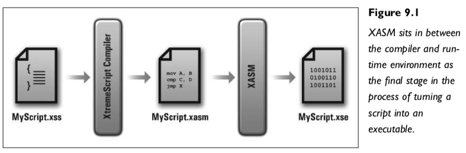
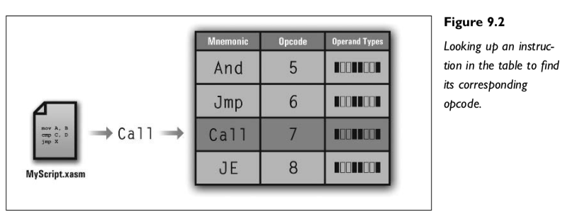
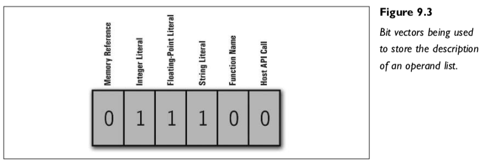
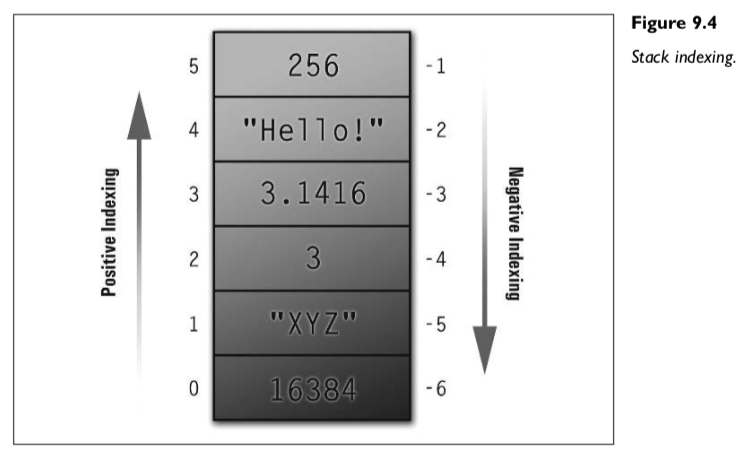
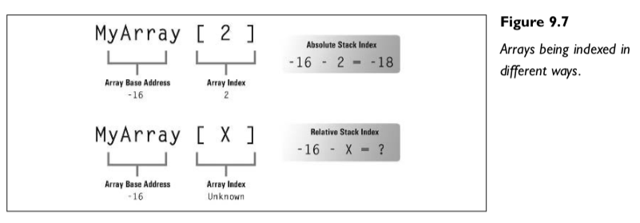
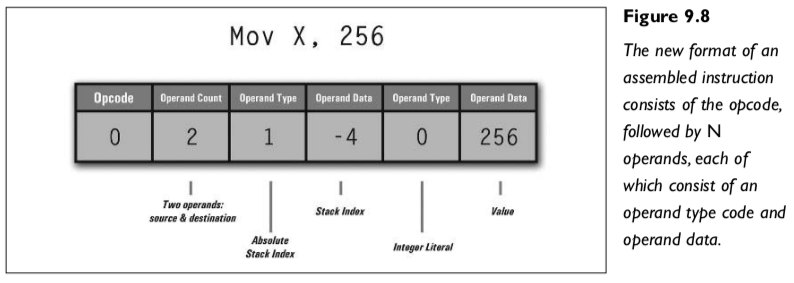
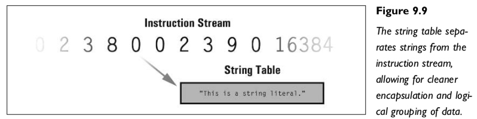
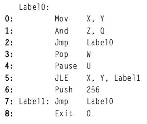
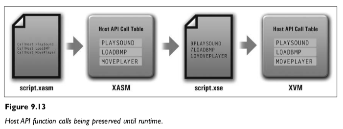

第九章 设计和实现XASM

XASM是XtremeScript Assembler的缩写，正如名称所示，它将XVM汇编脚本汇编成可在XtremeScript虚拟机上运行的可执行文件。该程序位于高级XtremeScript编译器（输出XVM汇编）和XVM之间，是整个系统的关键。



图9.1展示了XASM在其上下游组件中所处在位置

与复杂的高级语言编译器相比，XASM相对简单。虽然接下来我们有很多细节需要处理，但它本质上只是将指令助记符映射/翻译成对应的操作码，也把其他数据和文本转换成二进制数字。它实际上是一种“转换器/翻译器”：输入人类可读的源代码，输出可执行的机器代码。

本章将涵盖以下内容： 

- 更深入地探讨通用汇编程序的工作原理。 
- XASM的详细工作原理。 
- 汇编器构建的总体设计方案。 
- XASM的输出文件格式规范，即XVM可执行文件。 

强烈建议你在阅读本章时或之后阅读XASM汇编器的源代码。它可以在附带的CD上找到，它本身结构很好，并且有很好的注释。不论你阅读了这一章多少遍，也不管你在多大程度上已经自我感觉“完全掌握了”这一章，XASM源代码都是必读的。在理解了基本概念之后，通过查看实现代码的各个部分，你才能真正掌握它们。本章基本上是对XASM源代码的注解，请务必不要低估阅读源代码的重要性。

## 汇编器工作原理

汇编器的基本工作是将人类可读的汇编源代码转换为仅由数字组成的机器码。该过程包括以下几个主要步骤： 

- 根据“主”指令查找表将每个指令助记符转换为相应的操作码。 
- 根据变量和数组的作用域将所有引用转换为堆栈的索引。
- 记录每个行标签在指令流中的索引，并将所有对这些指令的引用（在跳转指令和调用中）替换为这些索引。
- 丢弃任何多余的或可读性高的内容，例如空格、逗号和其他分隔符。
- 将输出按照XVM可执行文件的格式写入二进制文件。

接下来我会详细介绍汇编器如何处理汇编源代码。汇编器的输出称为指令流，因为它把所有的操作码及其操作数顺序连贯地打包在一起，供虚拟机的虚拟处理器执行。

## 汇编指令的编译 

汇编器的主要职责是将指令助记符映射到操作码。我们会首先建立一个表存储所有的指令和对应的操作码，每当从源文件中读取一条指令时，都会查找这张表。如果找到，则输出对应的操作码。如果没有找到，那就是出错了，输出出错信息。或许图9.2能帮你了解这一过程。

这张表通常用哈希表实现，因为它非常快。当然，用C语言数组逐个比较字符串来手动搜索也不是不行。虽然它比哈希表慢得多，但我们的脚本通常都很小，你通常感知不到这点减速。即便这一步慢点，也不会影响程序最终的运行速度。



这张表里，除了助记符和操作码之外，每个条目还可以包含一些其他信息。我喜欢在这里存储该指令的操作码列表。操作码列表只是一系列的标志（通常用位向量数组表示），它用来确保程序为给定指令提供的操作数是正确的。例如，Mov指令接受两个参数。第一个参数Destination必须是内存引用，因为它是Source值将要存储的地方。第二个参数Source则既可以是内存引用，也可以是一个字面量。在表中保存Mov指令的地方，我们将存储一个操作码列表，表明这一情况。 我喜欢使用位向量数组来保存这个操作码列表。数组中的每个元素可以代表一个字节、一个整数、一个长整数或其他什么别的。数组的每个元素对应一个操作数，第一个元素对应第一个操作数，第二个元素对应第二个，以此类推。对于Mov指令，这将数组将有两个元素，元素索引分别是0和1。

第1个元素（索引0）对应目标（Destination），由于它只可以是内存引用，因此只把MEMORY_REF位置1。第2个元素（索引1）对应源（Source），会同时把MEMORY_REF和LITERAL_VALUE标志置1。还有一些位用来表示其他的操作数类型，例如用于跳转指令的LINE_LABEL，FUNCTION_REF，以及CALL等。详见图9.3。



如图9.2所示，这个表由三个部分组成，其中的信息足够我们编写一个汇编器。每次读取指令时，都会验证指令名是否在表格中，确保它是已知的助记符；读取操作数时，则会与存储在表格中的操作数列表进行匹配，并将其对应的操作码写入输出文件。当然，操作数也会被写入输出文件，但这个过程比汇编指令本身要复杂得多。要了解如何汇编操作数列表，我们首先需要知道如何汇编每种类型的操作数，然后才能处理整个操作数列表并将它们写入输出文件。接下来我们先学习如何汇编变量，之后再了解汇编操作数。

## 编译变量

变量的汇编方式相对简单。局部的变量和数组，在本质上只是给相对于函数栈帧顶部的堆栈索引取了一个容易记忆的符号名称。即使是全局变量，也存储在堆栈的底部。函数的堆栈帧通常由参数、函数的返回地址和本地数据组成。当前正在运行的函数的堆栈帧始终在堆栈顶部。如果该函数调用了另一个函数，则新函数就会接管堆栈栈顶。一旦新函数返回继续执行原函数，新函数的堆栈帧就会从堆栈中弹出，原函数的栈帧就又成为栈顶。

在第6章关于Lua的讨论中，我们曾经提到，Lua栈有两种访问方式：正索引和负索引。正索引从底部开始，所以索引越高，就越靠近栈的顶端。与正索引相反，负索引从栈顶开始读取栈的元素。因此，-1是栈顶，-2是紧挨栈顶的元素，以此类推。在处理栈帧时，我们也使用类似的技术。由于活动函数的栈帧始终位于栈的顶部，我们总是可以使用负索引相对于栈顶访问元素。见图9.4。



栈帧由三个部分构成。从栈栈向下依次是：局部数据，函数的返回地址和函数的实参（为什么使用此种布局？见[第8章](./chapter_8.md)）。因此，如果一个函数有四个局部变量和两个参数，则栈帧的大小为七个元素（4 + 2 + 1 = 7；为什么加1？因为还有函数的返回地址）。因此，栈帧占用栈的前七个元素。四个局部变量的索引为-1到-4，返回地址位于-5，两个参数位于索引-6和-7处。 

（为什么没有图9-5和图9-6？原书是有的，但图9-5把栈顶和栈底反过来画，容易让初学者犯迷糊，图9-6更是直接画错了，我就把它拿掉了。）

根据变量的声明顺序，可以将变量名替换为栈索引。假设我们在函数内顺序声明了以下四个局部变量，并且变量是按照它们声明的顺序进栈，也就是说（因此，第一个声明的变量X在栈上的位置最低，而最后声明的变量W离栈顶最近）：

```ASM
var X
var Y
var Z
var W
```

W在栈顶，它的索引是-1；Z在其后，索引是-2；Y是-3； X是-4。我们扫描源代码，当读到变量名的时候，就把它替换成刚刚计算出的索引。

然而，简单地用索引替换变量是不够的，这会导致无法区分栈索引和整数字面量。假设我们要汇编这个指令： `Mov Z, 4` 根据之前的分析，Z 的索引是 -2。再假设 Mov 指令对应的操作码是 0，那么汇编输出应该类似于： `0 -2 4` 当 XVM 接收到这些数据时，它会把它解释为“将值 4 移动到 -2 中”，这讲不通。因此，我们还需要在汇编操作数前面加上一个标志，以便区分已汇编的变量（即栈索引）和整数字面量。

假设堆栈索引的标志为 0，整数字面量的标志为 1。则汇编器的新输出如下： `0 0 -2 1 4`，其中的数字依次代表操作码，操作数类型，操作数数据，操作数类型，操作数数据。 

全局变量与局部变量有所不同，需要特别处理。我喜欢将全局变量存储在栈的底部，这样无论变量是局部的还是全局的，都可以方便得使用栈索引引用它们。栈顶使用负索引，栈底使用正索引，在指令流中的顺序不需要做任何更改。换言之，引用一个全局变量和引用一个局部变量的汇编形式完全一样，唯一的不同只是索引的符号。

## 编译操作数

上一节中介绍了如何区分变量的堆栈索引和整数字面量。遇到栈索引标志，运行环境期望后跟一个整数值，该值被视为栈索引。遇到整数字面量操作数标志，也期待后跟一个整数值，但这次的整数值仅仅是个整数值，不需要对其做其他处理。

然而操作数并非只有整数类型。表9.1列出了所有的操作数类型。

**表格 9.1 操作数类型**

| 类型                     | 示例                    | 描述                                          |
| ------------------------ | ----------------------- | --------------------------------------------- |
| 整数字面值               | 256                     | 一个整数                                      |
| 浮点字面值               | 3.14159                 | 一个浮点数                                    |
| 字符串字面值             | "L33T LIEK JEFF K.!!11" | 一个字符串                                    |
| 变量                     | MyVar                   | 单个变量                                      |
| 使用字面值索引的数组元素 | MyArray[15]             | 由整数字面量索引的数组元素                    |
| 使用变量索引的数组元素   | MyArray [X]             | 由变量索引的数组元素                          |
| 行标签                   | MyLabel                 | 一个行标签，在跳转指令中使用                  |
| 函数名                   | MyFunc                  | 一个函数名称，在 Call 指令中使用              |
| 主机 API 调用            | MyHostAPIFunc           | 一个主机 API 函数名称，在 CallHost 指令中使用 |

这个列表很容易理解，除了一个地方。为什么要把整数字面量索引的数组元素，和用变量索引的数组元素视为不同的类型？这是因为变量索引的元素数组只有到运行时才能确定到底是哪个元素，而整数字面量索引的元素，在编译时就能准确的知道它是哪一个。对于整数字面量索引的数组元素，我们甚至可以在编译时就将数组索引添加到数组的基础索引（栈索引）上，这将更有效率。但是，用变量索引的数组在汇编时，我们并不知道索引变量的值会是什么，这意味着我们只能写出数组的基础索（指针）和变量索引的索引（指针的指针）。见图9.7。



现在，每个操作数前面都有一个标识，虚拟机根据该标识正确地读取和解释操作数。整数字面量的标识可以是0，浮点数可以是1，字符串是2，变量是3， 两种类型的数组元素可以分别是4和5等等。只要虚拟机能正确理解汇编器输出操作数标识，标示自身的值是多少并不重要。

现在，每条指令还需要的最后一个信息，那就是一共有几个操作数。我们只需要对指令流输出做一个小的补充。在操作码和第一个操作数之间，我们插入一个整数值，它表示后面有几个操作数。对于Mov指令，这个数字总是2（源操作数和目标操作数）。对于Jmp指令，它总是1（标签操作数）。因此，对于下面这行代码：

```ASM
Mov    MyVar, 16384
```

假定 MyVar 保存在堆栈索引-8的地方，那么输出的机器码等效于： `0 2 3 -8 0 16384`

首先是操作码Mov（0）；然后是操作数的个数（2）；接着是第一个操作数的类型标识（3），因为它是一个变量，而变量的标识是3；接着是该变量的堆栈索引（-8），最后是第二个操作数。第二个操作数是一个整数字面量，所以它的类型标识是0，其后是该值本身（16384）。图9.8是一个类似的例子。



你可能会好奇为什么要记录操作数的个数。没错，Mov的操作数总是两个，Jmp操作数总是1个。既然可以从操作码推导出它的操作数个数，似乎没有必要包含这些数据。有两个原因，第一，我们的语言会进化，现在支持两个操作数的指令，将来有可能支持第三个，或者更多的操作数。现在就在指令流结构中添加操作数个数，之后不论我们的语言如何进化，都不需要对汇编器和解释器做大的改动。未雨绸缪，何乐不为？

## 编译字符串字面量

字符串的汇编相对简单，但并不是直接嵌入的方式。我们确实把像整数这样的简单字面量直接塞到了指令流里，然而如果我们以同样的方式处理字符串，就意味着要在本来简单的指令流中塞入字符串数据块。

```ASM
Mov    X, "This is a string literal."
Mov    Y, 16384
```

上面这两行代码，如何我们采用处理整数字面量同样的方式处理字符串，就会得到这样的机器码指令流：

```ASM
0 2 3 8 This is a string literal 0 2 3 9 0 16384
```

这使得简单清晰的指令流变得混乱。如果我们在汇编时把字符串加载到一个称为字符串表的独立结构，这个表包含程序中的所有字符串，每个字符串有唯一且连续的索引（这意味着它是一个简单的字符串数组）。这样我们就可以在指令流中将字符串替换为它在字符串表中的索引。至于字符串表本身，我们会将它完整地写入到输出文件的另一部分。同样是上面这两行代码，由于两行代码里只有一个字符串，它会被加载到索引0的字符串表中。这样一来，指令流将变成: 

```ASM
0 2 3 8 0 0 2 3 9 0 16384
```

显然这样做更好。图9.9说明了指令流和字符串表的分离。



## 编译跳转和函数调用

行标签用一个标识符标记指令的位置，以便在代码中的其他地方可以跳转到这个地方。函数名称与行标识相似，其不同之处在于它标记一个指令块而不是单个指令。此外，函数还为代码块提供了局部作用域和堆栈帧。

要汇编行标签和函数跳转有两种常见方法：第一种方法称为“二次扫描法”，对源文件的第一遍扫描找出所有的行标签，而第二次扫描则用第一次扫描的结果（每个行标签的索引）替换跳转指令中的行标签。

我们的目标很单纯，就是确定每个行标签对应哪个指令，然后使用这些指令的索引来替换掉跳转指令中的标签。看下面这个例子：

```ASM
Label0:
	Mov 	X,Y
	And 	Z,Q
	Jmp 	Label0
	Pop 	W
	Pause U
	JLE		X, Y, Label1
	Push	256
Label1: Jmp Label0
	Exit 0
```

这里有两个标签和三个跳转指令。第一个标签指向第一个指令（Mov X, Y），而第二个（也是最后一个）标签指向第八个指令（Jmp Label0）。

**注意**

被标记的指令总是紧跟在标签后面的那个。标签和指令之间可以有任意数量的空白符号，包括换行，也就是说它们不必出现在同一行。

下面是同样的代码，带有行号以帮助解释所有这些是如何工作的：



这九条指令从0到8编号，任何不包含指令的行（即使包含标签声明）都不计入编号。另外，行标签允许先引用后定义，这个例子里的`Label1`就是这样：Label1被第5行的JLE指令引用，然后它在第7行声明。这称为前向引用，对于汇编编程来说非常方便，也非常重要。不过，标签引用允许出现在其声明之前这一特性，是我们在汇编行标签时不得不扫描源代码两遍的直接原因。在我们深入讨论这一问题之前，让我们先看一下上面的代码被汇编之后的样子：

```ASM
Mov 	X,	Y 
And 	Z,	Q 
Jmp 	0
Pop 	W
Pause U
JLE 	X, 	Y, 	7 
Push 	256
Jmp 	0 
Exit 	0
```

可以看到，标签声明不见了。在标签引用的位置，对应着目标指令索引的一个整数值。当执行到跳转指令时，运行时环境会将执行流程路由到目标指令。你一定好奇会我们是如何计算出这些指令索引的，答案是二次扫描法。这种方法简单直观，下面让我们来看看第一遍扫描的目标以及如何达成这个目标。 

- 第一遍扫描扫描整个源代码文件并为每个指令分配一个顺序索引。如果一行只包含编译指令、指令标签、空格或者注释，那这一行就不计数。 
- 这遍扫描的目标是生成一个类似于前面讨论的主指令查找表的行标签数组。该数组的每个元素包含行标签字符串本身以及它所指向的指令的索引。利用这两个字段，我们可以轻松地在生成的机器码中为跳转指令匹配目标指令。
- 当检测到新的行标签声明时，就把它添加到数组中。比如在源代码中遇到"MyLabel："，就创建一个名字为"MyLabel"的新元素（注意没有冒号！）。此外，我们还应确保不能有重复声明的标签。也就是说，在添加这个行标签时要检查该标签是否已经在这个数组中存在。
- 一个行标签总是指向紧随其后的指令。因此，每当检测到一个行标签，我们就将指令计数器的值复制到一个临时变量，并使用其值作为行标签指向的目标。该值连同行标签的名字被保存在数组的一个新元素中。确定行标签指向的目标指令的过程称为标签解析。这个过程一直持续，直到扫描完整个源文件。最终我们得到一个包含着所有行标签及其指向指令索引的数组。不过，我们并未输出任何指令流，因为这一遍扫描的目标不是生成机器码。

这就完成了第一遍扫描，现在我们来看一下第二遍扫描。第二遍扫描的目标是编译源代码文件并输出机器码。

- 第二遍扫描遍历源文件的每个指令，就像第一次扫描一样。当找到每个指令时，使用之前讨论过的技术将其转换为机器码。如果发现跳转指令，就接着输出一个行标签操作数标识。紧结着这个标识，输出其目标指令的索引而非行标签文本本身。 
- 换言之，每当发现跳转指令，就读取其行标签字符串并检索第一遍扫描构建的行标签数组，找到对应的行标签元素，得到其对应的指令索引，并输出该索引的值到指令流。类似地，这一过程称为跳转解析。注意，如果在标签数组中找不到该标签，这意味着一定有什么地方出错了，要向用户报告这个错误。

这就是用两遍扫描处理行标签的基本过程。最终结果是跳转指令直接指向目标指令，仿佛从来没有使用过行标签。很妙，对吧？ 处理函数和处理行标签的方式基本相同。我们可以在第一遍扫描中，在收集和解析行标签的同时，收集和解析函数并更新符号表。来，复习一下Func指令的格式：

```ASM
Func Add {
    Param  X						; Assign names to the two parameters
    Param  Y
    Var    Sum      		; Create a local variable for the sum
    Mov    Sum, X				; Perform the addition
    Add    Sum, Y   
    Mov    _RetVal, Sum	; Store the sum in the _RetVal register
}
```

这是一个简单的加法函数。本质上，函数是加强版的行标签：花括号帮助我们确定函数的作用域，堆栈帮我们确定函数的返回地址。 Call指令本质上是先把函数返回地址压入堆栈的无条件跳转，因此我们可以用处理行标签和跳转指令类似的方式处理函数名解析，以及编译Call指令。在第一遍扫描（就是前面我们谈论的那个“第一遍扫描”），我们收集并解析每个函数名，将它与其作用域内第一个指令的索引相关联。以Add函数为例，第一个真正的指令是Mov Sum, X（像Param和Var这样的编译指令是伪指令，不是真正的机器指令），因此我们会把该指令的索引与函数名字“Add”一起存储在函数数组中。这个数组的结构与标签数组一样，每个元素包含一个函数名和一个指令索引。

在第二遍扫描时，我们可以用函数入口点的索引替换每个Call指令中的函数名参数。因此，如果Add的入口点是脚本中的第204条指令，则调用该函数的任何Call指令将从： 

```ASM
Call Add 
```

变成： 

```ASM
Call 204
```

很简单，对吗？然而由于函数自身的复杂性，我们并不能这样做。

函数是加强版的标签，调用函数也不仅仅只是跳转到它的第一条指令——否则，我们只要用跳转指令和普通行标签就行了，没必要引入函数这个概念。函数有自己的作用域，在调用函数时会建立适当的堆栈帧，其中包含传递的参数、返回地址和本地数据。

因此，我们不会将 Call 指令中的函数名替换为函数的入口点，而是把它替换为函数表中的该函数的索引。函数表是一个结构，它创建于脚本编译期间，供脚本运行时访问。每当调用函数时，虚拟机就使用这个索引从函数表中提取该函数的信息。利用这些信息可以构造函数的堆栈帧，和其他基本信息，例如函数的入口点。

由于函数和它们的堆栈帧因机器、语言和编译器而异，因此我们暂时不涉及这个问题过深，在本章后面我会详细。

## XASM概述

XASM是一个典型的汇编器：它被设计成为一种无类型虚拟机生成机器码，实现起来相对容易。

除了基本的汇编器功能外，它还有一些其他功能：包括上一章讨论的那些用于声明变量、数组、函数等等的编译指令。总体而言，汇编器负责做以下事情：

- 对源代码进行第一遍扫描，处理编译指令，包括处理行标签索引和函数入口。
- 对源代码进行第二遍扫描，将每个汇编指令编译成其机器码形式，同时解析跳转标签和函数调用。
- 用XVM能够识别的格式将第二遍扫描的结果写入二进制文件。

接下来我们将分主题讨论如何构建这个汇编器。在理解消化了各个主题之后，我们的最终目标是将所有内容整合到一个功能完备的程序之中。

## 内存管理

尽管节省内存通常是个好主意，但就本书而言，基于以下原因，我们选择把整个脚本一次载入内存而不是读一点处理一点，再读一点处理一点。

- 实现起来更容易，我们的主要目标是先学会怎么做。
- 编译性能会更好，因此大大减少了硬盘io。

## 输入： XVM汇编脚本的结构

知己知彼，百战不殆。要编译人类手写的代码，就要了解人类手写代码的复杂性。毕竟每个人的编码习惯都不一样。更不用说人类还容易打错字，犯低级错误。

## 编译指令

除了汇编指令之外，多数脚本都会有一定数量的编译指令来帮助编译程序来处理这个脚本。

#### SetStackSize

指定栈大小，这个指令非常简单

```ASM
SetStackSize 1024
```

约定该脚本的栈最多支持1024个元素。注意：

- 设定值 0 等于没有设定：系统会使用默认值创建堆栈。
- 堆栈大小不可以是负整数
- 该指令在整个脚本中只可以出现一次。

#### Func

```ASM
Func FuncName {
	; Code
}
```

- 非编译指令只能出现在函数内
- _Main 函数作为脚本的入口会被自动调用
- 函数不允许重名
- 函数不能嵌套

XASM 需要确定脚本是否有定义 _Main函数，并在输出文件中做适当的标记。你大概应该会意识到编译结果中并不包含函数标识符，如果XASM不在输出文件里做好标记，就没有办法知道脚本里有没有定义 _Main函数。

#### Var / Var []

```ASM
Var X
Var Y
Var Array[16]
```

- 一行只可以定义一个变量
- 函数外定义的是全局变量
- 函数内定义的是局部变量
- **变量不允许重名：局部变量之间，以及和全局变量都不允许重名**。当然了，不同的函数内当然可以使用相同的变量名。不然这门语言也太难用了。
- 所有声明的变量和数组都是静态的
  - 只有整数字面量可以用于数组的长度
- 尽管先使用后声明变量在XASM中是允许的，但这样做一点好处也没有。
- 局部数据的栈索引从 -2 开始（因为栈顶-1留给了什么别的东西？）

#### Param

```ASM
Param ParamName
```

与 Var 不同，Param并不申请新的栈空间，而是引用已经压进栈的数据。因为同样的原因，Param编译指令仅可以在函数内出现，**没有全局 Param这回事**。

- 也没有 Param[] 数组
- 若压入了参数但函数里却没有 Param指令，没有其他方法访问这些参数
- 如果压入了过多的参数，多余的参数不会被使用，程序不会被破坏
- 压入过少的参数将导致不是参数的数据被视为参数，这已经足够坏了；当函数执行完毕清理堆栈时，还会导致弹出不应该弹出的父函数的本地数据，从而酿成更严重的后果。

#### 标识符

变量名，参数名，函数名等是XASM语言中的标识符。与大部分别的语言一样，标识符只能由下划线、字母和数字组成，且首字符不可以是数字。

另一方面，也大多数其他语言不同的是，**XASM语言的标识符不区分大小写。**

#### 汇编指令

```ASM
Mnemonic 	Operand, Operand, Operand
```

- 指令不需要 `;` 结尾
- 一行只能写一条指令

较难的部分在于指令解析器必须能够解析：

- 整数与浮点数字面量
- 字符串字面量
- 变量
- 数组索引
- 行标签，函数名，以及Host API调用

发现任何缺少操作数的指令，都要报告错误。

#### 行标签

```ASM
Label:
```

- 不支持全局行标签
  - 行标签必须位于函数内

#### Host API调用

```ASM
CallHost PlaySound
```

调用Host API函数与调用普通函数很相似：调用之前先把参数压入堆栈，调用之后可以从 _RetVal 寄存器拿到返回值。

然而，对于Host API，汇编器必须保存Host API函数名，因为Host API函数并不是定义在用户源代码之中。换言之，在运行程序的时候，XVM需要知道Host  API函数的名字才能调用它们。见下图：




#### _Main() 函数

如果脚本里有 \_Main 函数，该函数将成为脚本的入口，脚本会自动运行该函数。基于这一特性，该函数内不可以有 Param编译指令。也就是说，\_Main 函数不支持参数。

与普通函数相比，\_Main 函数的另一点特殊之处是，汇编器会在函数的末尾自动添加 Exit 指令而不是 Ret 指令。

#### _RetVal 寄存器

这是XASM中唯一的通用寄存器，用于储存函数的返回值。

#### 注释

```ASM
; This is a comment
Mov 	X, Y	; So is this
```

- XASM 不支持多行注释

#### 完整的脚本示例

```ASM
; Example script
; Demonstrates the basic layout of an XVM
; assembly-language script.
; ---- Globals ------------------------------------------------
    Var    GlobalVar
    Var    GlobalArray [ 256 ]
; ---- Functions ----------------------------------------------
    ; A simple addition function
    Func MyAdd
    {
        ; Import our parameters
        Param   Y
        Param   X
        ; Declare local data
        Var    Sum
        Mov    Sum, X
        Add    Sum, Y
        ; Put the result in the _RetVal register
        Mov    _RetVal, Sum
        ; Remember, Ret will be automatically added
}
    ; Just a bizarre function that does nothing in particular
    Func MyFunc
    {
        ; This function doesn't accept parameters
        ; But it does have local data
        Var    MySum
        ; We're going to test the Add function, so we'll
        ; start by pushing two integer parameters.
        Push   16
        Push   32
        ; Next we make the function call itself
        Call   MyAdd
        ; And finally, we grab the return value from _RetVal
        Mov    MySum, _RetVal
        ; Multiply MySum by 2 and store it in GlobalVar
        Mul    MySum, 2
        Mov    GlobalVar, MySum
        ; Set some array values
        Mov    GlobalArray [ 0 ], "This"
        Mov    GlobalArray [ 1 ], "is"
        Mov    GlobalArray [ 2 ], "an"
        Mov    GlobalArray [ 3 ], "array."
}
; The special _Main () function, which will be automatically executed
Func _Main
{
    ; Call the MyFunc test function
    Call MyFunc
}
```

接下来你要实现的编译程序，能理解并处理这个汇编脚本里的所有东西，有没有一点激动？Let's go！

### 输出： XVM可执行文件的结构

- 编译程序直接输出XVM可执行文件
- 可执行文件的扩展名是 .XSE (XtremeScript Executable)
- 主程序负责把可执行文件载入内存供XVM执行

#### 概要

- 数据以字节、字及双字存储，即1字节，2字节和4字节
- 浮点数直接写入文件--由C标准IO函数处理
- 字符串总是有一个4字节长的长度标识，而非`\0`结尾


图9.15 XSE可执行文件的结构

- 文件头：Main Header
- 指令流
- 字符串表
- 函数表
- Host API 调用表


#### Main Header

存储脚本的基本信息，它是定长的，所储存的内容见 表9.2 和 图9.16

##### 表 9.2 XSE Main Header

| Name                | Size (in Bytes) | Description                              |
| ------------------- | --------------- | ---------------------------------------- |
| ID String           | 4               | 四个字符，保存XSE ID，如“XSE0”           |
| Version             | 2               | 版本号，首字节是主版本，第二字节是子版本 |
| Stack Size          | 4               | set by SetStackSize； 0 代表使用默认值   |
| Global Data Size    | 4               | 所有全局数据的总尺寸                     |
| Is _Main() Present? | 1               | 若脚本有_Main函数，则值为1， 否则为 0    |
| _Main() Index       | 4               | 函数表中 _Main函数的索引                 |


#### 指令流

##### 表9.3 指令流结构

| Name           | Size(In Bytes) | Description              |
| -------------- | -------------- | ------------------------ |
| Size           | 4              | 指令流中的指令总数       |
| Stream         | N              | 不定长的指令结构流       |

##### 9.4 指令结构

| Name           | Size(In Bytes) | Description              |
| -------------- | -------------- | ------------------------ |
| Opcode         | 2              | 指令的操作码，对应一个VM |
| Operand Stream | N              | 指令的操作数流           |

##### 9.5 操作数流结构

| Name           | Size(In Bytes) | Description          |
| -------------- | -------------- | -------------------- |
| Size           | 1              | 流中操作数的个数     |
| Operand Stream | N              | 不定长的操作数结构流 |

##### 9.6 操作数结构

| Name           | Size(In Bytes) | Description                          |
| -------------- | -------------- | ------------------------------------ |
| Type           | 1              | 操作数的类型（整数字面量，变量等等） |
| Operand Stream | N              | 操作数本身                           |


图9.17是一个指令流的样本。请留意流的层级结构：指令流由指令组成，指令包含操作数，而操作数又包含类型和数据。

##### 操作数类型


**表9.7 操作数类型码**

|Code|名字|描述|
|:--:|---|---|
|0|整数字面量||一个整数，如256 或-1024|
|1|浮点字面量|一个浮点数，如3.14159|
|2|字符串字面量索引|一个字符串表的索引，表示一个字符串字面量|
|3|绝对栈索引|栈的直接索引，如-6或8，用于变量或者由整数字面量索引的数组元素|
|4|相对栈索引|栈上数组的元素索引，用于变量索引的数组元素|
|5|指令索引|指令流的元素索引，用作跳转目标|
|6|函数索引|函数表索引，用于Call指令调用函数|
|7|Host API调用索引|HostAPI调用表索引，用于CallHost指令调用主机API|
|8|寄存器|目前仅用于\_RetVal|